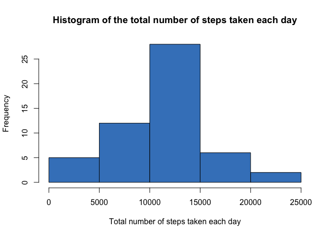
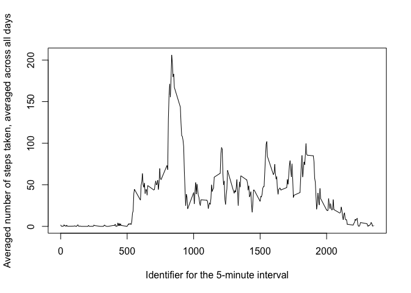
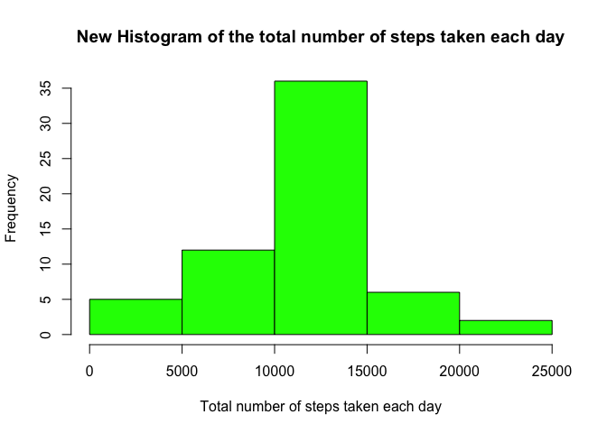
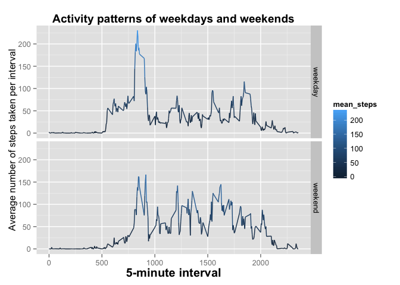

# Reproducible Research: Peer Assessment 1
This report summarizes the analysis of data from a personal activity monitoring device. This device collects data at 5 minute intervals through out the day. The data consists of two months of data from an anonymous individual collected during the months of October and November, 2012 and include the number of steps taken in 5 minute intervals each day.

We will disscuss following steps in analysing of that data:

  1. Loading and proprocessing the data
  2. What is the mean total of steps taken per day?
  3. What is the average daily activity pattern?
  4. A strategy on how we treated the missing value and investigating the effect of missing value. 
  5. Are there differences in activity patterns between weekdays and weekends
  6. The main conclusion of this analysis

The report is a first part of an online Data Science course at John Hopkins Bloomberg
School of public health. More information about the course and this assignment
can be found at [https://github.com/rdpeng/RepData_PeerAssessment1](https://github.com/rdpeng/RepData_PeerAssessment1).

### Loading and preprocessing the data

```r
library(lubridate)
library(dplyr)
library(ggplot2)

activity <- read.csv("activity.csv")
summary(activity)
```

```
##      steps                date          interval     
##  Min.   :  0.00   2012-10-01:  288   Min.   :   0.0  
##  1st Qu.:  0.00   2012-10-02:  288   1st Qu.: 588.8  
##  Median :  0.00   2012-10-03:  288   Median :1177.5  
##  Mean   : 37.38   2012-10-04:  288   Mean   :1177.5  
##  3rd Qu.: 12.00   2012-10-05:  288   3rd Qu.:1766.2  
##  Max.   :806.00   2012-10-06:  288   Max.   :2355.0  
##  NA's   :2304     (Other)   :15840
```

```r
### Converte to date format using the package "lubridate"
activity$date <- ymd(activity$date)
```

### What is the mean total number of steps taken per day?
1. Calculate the total number of steps taken per day

```r
# Group by date, using the package dplyr
by_date <- group_by(activity, date)
total_steps_per_day<- summarize(by_date, sum(steps))
names(total_steps_per_day) <- c("date", "sum_steps")
head(total_steps_per_day)
```

```
## Source: local data frame [6 x 2]
## 
##         date sum_steps
## 1 2012-10-01        NA
## 2 2012-10-02       126
## 3 2012-10-03     11352
## 4 2012-10-04     12116
## 5 2012-10-05     13294
## 6 2012-10-06     15420
```

2. Make a histogram of "the total number of steps taken each day"

```r
# Prepare plot
title <- "Histogram of the total number of steps taken each day"
xLabel <- "Total number of steps taken each day"
par(mfrow = c(1,1))

# Make plot
hist(total_steps_per_day$sum_steps,
     main = title,
     xlab = xLabel,
     col = "#4183c4")
```

 


3. Calculate and report the mean and median total number of steps taken per day


```r
mean(total_steps_per_day$sum_steps, na.rm =T)
```

```
## [1] 10766.19
```

```r
median(total_steps_per_day$sum_steps, na.rm = T)
```

```
## [1] 10765
```

### What is the average daily activity pattern?
1. Make a time series plot (i.e. type = "l") of the 5-minute interval (x-axis) and 
the average number of steps taken, averaged across all days (y-axis)


```r
by_interval <- group_by(activity, interval)
averagedSteps_byInterval <- summarize(by_interval,mean(steps, na.rm=T))
names(averagedSteps_byInterval) <- c("interval", "mean_steps")

plot(averagedSteps_byInterval$interval, averagedSteps_byInterval$mean_steps, type="l", 
     xlab ="Identifier for the 5-minute interval", 
     ylab ="Averaged number of steps taken, averaged across all days")
```

 

2. Which 5-minute interval, on average across all the days in the dataset, 
contains the maximum number of steps?


```r
temp <- filter(averagedSteps_byInterval, 
                         mean_steps == max(averagedSteps_byInterval$mean_steps))
theMaxInterval <- temp[1,1]
```

**The 5-minute interval that contains the maximum number of steps is 835**

### Imputing missing values
1- Calculate and report the total number of missing values in the dataset 
(i.e. the total number of rows with NAs)


```r
# list rows of data that have missing values 
rows_of_na <- activity[!complete.cases(activity),]

# The total number of rows with NAs
nof_row <- nrow(rows_of_na)
```
**The total number of rows with NAs is 2304**

2. Strategy for filling in all of the missing values in the dataset: 
Filling the missing value using the mean for that 5-minute interval, averaged over all days

3. Create a new dataset that is equal to the original dataset but with the 
missing data filled in.
  

```r
new_activity <- activity
for (i in 1:nof_row) {  
  # Get the date and the identifier for the row that has the missing value
  na_date = rows_of_na[i,"date"]
  na_identifier = rows_of_na[i,"interval"]  
  # 
  # Get the averaged value of the 5-minute identifier
  #
  # get the logical vector where there is one True (all others are False)
  a_log = averagedSteps_byInterval$interval == na_identifier 
  a_row = averagedSteps_byInterval[a_log, ] # get the row (1 row)
  a_average = a_row[1,2]    
  # 3- Create a new dataset that is equal to the original dataset but with the 
  # missing data filled in.
  new_activity$steps[new_activity$date==na_date & new_activity$interval == na_identifier] <- a_average  
}
```


4. Make a new histogram of the total number of steps taken each day and calculate 
and report the mean and median total number of steps taken per day. 


```r
new_by_date <- group_by(new_activity, date)
# Total number of steps taken per day
new_total_steps_per_day<- summarize(new_by_date,sum(as.numeric(steps), na.rm =T))
names(new_total_steps_per_day) <- c("date", "sum_steps")
head(new_total_steps_per_day)
```

```
## Source: local data frame [6 x 2]
## 
##         date sum_steps
## 1 2012-10-01  10766.19
## 2 2012-10-02    126.00
## 3 2012-10-03  11352.00
## 4 2012-10-04  12116.00
## 5 2012-10-05  13294.00
## 6 2012-10-06  15420.00
```

```r
# Prepare plot
new_title <- "New Histogram of the total number of steps taken each day"
xLabel <- "Total number of steps taken each day"
par(mfrow = c(1,1))
# 2- Make a histogram of the total number of steps taken each day
hist(new_total_steps_per_day$sum_steps,
     main = new_title,
     xlab = xLabel,
     col = "green")
```

 

```r
# 3- Calculate and report the mean and median total number of steps taken per day
mean(new_total_steps_per_day$sum_steps, na.rm =T)
```

```
## [1] 10766.19
```

```r
median(new_total_steps_per_day$sum_steps, na.rm = T)
```

```
## [1] 10766.19
```

**Do these values differ from the estimates from the first part of the assignment?** 

- *Comparing the previous numbers, that is, mean = 10766,19 and median = 10765, with the new numbers, mean= 10799.19 and median = 10766.19. There was no significantly differencess.*

**What is the impact of imputing missing data on the estimates of the total daily 
number of steps?**

- *The new histogram (green) is slighly more resembled the standard distributed compare with the previous one (blue), ones can see that the left handside of the histogram is slighly lower.*

### Are there differences in activity patterns between weekdays and weekends?
1. Create a new factor variable in the dataset with two levels – “weekday” 
 and “weekend” indicating whether a given date is a weekday or weekend day.
 

```r
# Two levels
weekdayLevels <-c("weekday", "weekend");

# labeling each day as: mon,tue,wed,...,sun
new_activity$day <- wday(new_activity$date, label = T)
new_activity$day <- as.character(new_activity$day)

# A day is a weekday or a weekend?
nof_row = nrow(new_activity)
for (i in 1:nof_row) {
  if ((new_activity[i,"day"] == "Sat") | (new_activity[i,"day"] == "Sun")) 
    new_activity[i,"day"] <- weekdayLevels[2]      
  else 
      new_activity[i,"day"] <- weekdayLevels[1]
}
```

2. Make a panel plot containing a time series plot (i.e. type = "l") of the 
 5-minute interval (x-axis) and the average number of steps taken, averaged 
 across all weekday days or weekend days (y-axis). 


```r
by_weekdays_interval <- group_by(new_activity,day, interval)
average_steps_weekdays_weekends <- summarize(by_weekdays_interval, mean(as.numeric(steps)))
names(average_steps_weekdays_weekends) <- c("day", "interval", "mean_steps")

p1 <- ggplot(data=avSteps, aes(x=interval, y=mean_steps, color=mean_steps)) + 
  facet_grid(day~.) + 
  geom_line() +   
  ylab("Average number of steps taken per interval") + 
  xlab("5-minute interval") +
  ggtitle("Activity patterns of weekdays and weekends") +
  theme(plot.title = element_text(lineheight=.8, face="bold")) +
  theme(axis.title.x = element_text(face="bold", size=15))
 
print(p1)
```

 

### Conclusion
As expected the activity during the weekend were shifted to later hours comparing 
to the normal weekdays


